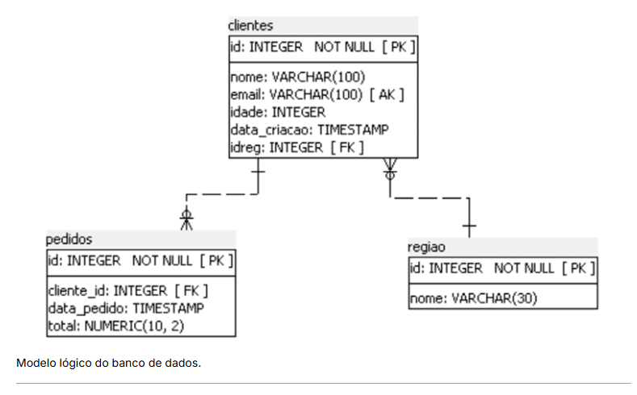

# Criação, alteração e remoção de tabelas relacionadas na prática

Vamos à prática de alteração e eliminação de tabelas relacionadas entre si. Veremos, ainda, como executar scripts no PostgreSQL.

Para executar o laboratório, vamos considerar o  modelo lógico apresentado a seguir.



Para realizar o laboratório, siga os passos apresentados a seguir.


1. Faça conexão ao SGBD utilizando o pgAdmin4.

2. Acesse o  banco tabelas_lab e abra o query tool.

3. Altere a tabela cliente acrescentando a coluna endereço de 200 caracteres.

4. Altere a tabela cliente tornando a coluna idade de preenchimento obrigatório.

5. Altere o nome da coluna endereço de clientes para endereco_residencial.

6. Elimine a coluna endereco_residencial da tabela cliente.

7. Altere a tabela cliente acrescentando uma coluna chamada idreg como chave estrangeira para a tabela região.

8. Associar clientes a uma região.

9. Elimine a tabela pedido.

10. Elimine a tabela região.

11. Elimine a tabela cliente.

12. Rode o script tabelaslab para recriar as tabelas com todas as restrições.

# Laboratório PostgreSQL - Alteração e Manipulação de Tabelas Relacionadas

Este laboratório apresenta todas as etapas necessárias para criação do ambiente, inserção de dados e execução dos comandos SQL de alteração e remoção de tabelas conforme os exercícios propostos.

---

# 1. Criando o Banco de Dados

```sql
CREATE DATABASE tabelas_lab;
```

Após criar o banco de dados, conecte-se a ele utilizando o **pgAdmin 4** ou o **PSQL**.

---

# 2. Criando o Schema

```sql
CREATE SCHEMA cadastro;
```

---

# 3. Criando a Tabela REGIAO

```sql
CREATE TABLE cadastro.regiao (

    id INTEGER GENERATED ALWAYS AS IDENTITY,

    nome VARCHAR(30),

    CONSTRAINT pk_regiao
        PRIMARY KEY (id)

);
```

---

# 4. Criando a Tabela CLIENTES

```sql
CREATE TABLE cadastro.clientes (

    id INTEGER GENERATED ALWAYS AS IDENTITY,

    nome VARCHAR(100),

    email VARCHAR(100) UNIQUE,

    idade INTEGER,

    data_criacao TIMESTAMP DEFAULT CURRENT_TIMESTAMP,

    CONSTRAINT pk_clientes
        PRIMARY KEY (id)

);
```

---

# 5. Criando a Tabela PEDIDOS

```sql
CREATE TABLE cadastro.pedidos (

    id INTEGER GENERATED ALWAYS AS IDENTITY,

    cliente_id INTEGER NOT NULL,

    data_pedido TIMESTAMP DEFAULT CURRENT_TIMESTAMP,

    total NUMERIC(10,2),

    CONSTRAINT pk_pedidos
        PRIMARY KEY (id),

    CONSTRAINT fk_cliente

        FOREIGN KEY (cliente_id)

        REFERENCES cadastro.clientes(id)

);
```

---

# 6. Populando a Tabela REGIAO

```sql
INSERT INTO cadastro.regiao (nome)
VALUES

('Norte'),
('Nordeste'),
('Centro-Oeste'),
('Sudeste'),
('Sul');
```

---

# 7. Populando a Tabela CLIENTES

```sql
INSERT INTO cadastro.clientes
(
    nome,
    email,
    idade
)
VALUES

('João Silva','joao@email.com',30),

('Maria Oliveira','maria@email.com',24),

('Pedro Santos','pedro@email.com',41),

('Ana Souza','ana@email.com',35),

('Lucas Lima','lucas@email.com',28);
```

---

# 8. Populando a Tabela PEDIDOS

```sql
INSERT INTO cadastro.pedidos
(
    cliente_id,
    total
)
VALUES

(1,250.50),

(1,899.90),

(2,120.00),

(3,540.35),

(4,75.90),

(5,1800.00);
```

---

# Situação Inicial do Modelo

```
CLIENTES

id
nome
email
idade
data_criacao

PEDIDOS

id
cliente_id
data_pedido
total

REGIAO

id
nome
```

---

# Laboratório

## Passo 1

Conecte-se ao PostgreSQL utilizando o **pgAdmin 4**.

---

## Passo 2

Abra o banco **tabelas_lab**.

Clique em **Query Tool**.

---

## Passo 3

Adicionar a coluna **endereco**.

```sql
ALTER TABLE cadastro.clientes

ADD endereco VARCHAR(200);
```

---

## Passo 4

Tornar a coluna **idade** obrigatória.

```sql
ALTER TABLE cadastro.clientes

ALTER COLUMN idade

SET NOT NULL;
```

---

## Passo 5

Alterar o nome da coluna **endereco**.

```sql
ALTER TABLE cadastro.clientes

RENAME COLUMN endereco

TO endereco_residencial;
```

---

## Passo 6

Remover a coluna **endereco_residencial**.

```sql
ALTER TABLE cadastro.clientes

DROP COLUMN endereco_residencial;
```

---

## Passo 7

Adicionar a coluna **idreg**.

```sql
ALTER TABLE cadastro.clientes

ADD COLUMN idreg INTEGER;
```

Adicionar a chave estrangeira.

```sql
ALTER TABLE cadastro.clientes

ADD CONSTRAINT fk_regiao

FOREIGN KEY (idreg)

REFERENCES cadastro.regiao(id);
```

---

## Passo 8

Associar cada cliente a uma região.

```sql
UPDATE cadastro.clientes

SET idreg = 4

WHERE id = 1;
```

```sql
UPDATE cadastro.clientes

SET idreg = 5

WHERE id = 2;
```

```sql
UPDATE cadastro.clientes

SET idreg = 2

WHERE id = 3;
```

```sql
UPDATE cadastro.clientes

SET idreg = 1

WHERE id = 4;
```

```sql
UPDATE cadastro.clientes

SET idreg = 3

WHERE id = 5;
```

Consultar:

```sql
SELECT

c.id,

c.nome,

r.nome AS regiao

FROM cadastro.clientes c

INNER JOIN cadastro.regiao r

ON c.idreg = r.id;
```

---

## Passo 9

Eliminar a tabela **PEDIDOS**.

```sql
DROP TABLE cadastro.pedidos;
```

---

## Passo 10

Eliminar a tabela **REGIAO**.

Como existe uma chave estrangeira apontando para REGIAO, a remoção simples retornará erro.

```sql
DROP TABLE cadastro.regiao;
```

Para remover automaticamente as dependências:

```sql
DROP TABLE cadastro.regiao CASCADE;
```

---

## Passo 11

Eliminar a tabela **CLIENTES**.

```sql
DROP TABLE cadastro.clientes;
```

---

## Passo 12

Executar novamente o script de criação das tabelas para recriar toda a estrutura do banco de dados.

```sql
CREATE TABLE cadastro.regiao (

    id INTEGER GENERATED ALWAYS AS IDENTITY,

    nome VARCHAR(30),

    PRIMARY KEY (id)

);
```

```sql
CREATE TABLE cadastro.clientes (

    id INTEGER GENERATED ALWAYS AS IDENTITY,

    nome VARCHAR(100),

    email VARCHAR(100) UNIQUE,

    idade INTEGER NOT NULL,

    data_criacao TIMESTAMP DEFAULT CURRENT_TIMESTAMP,

    idreg INTEGER,

    PRIMARY KEY (id),

    CONSTRAINT fk_regiao

        FOREIGN KEY (idreg)

        REFERENCES cadastro.regiao(id)

);
```

```sql
CREATE TABLE cadastro.pedidos (

    id INTEGER GENERATED ALWAYS AS IDENTITY,

    cliente_id INTEGER,

    data_pedido TIMESTAMP DEFAULT CURRENT_TIMESTAMP,

    total NUMERIC(10,2),

    PRIMARY KEY (id),

    CONSTRAINT fk_cliente

        FOREIGN KEY (cliente_id)

        REFERENCES cadastro.clientes(id)

);
```

---

# Consultas para Verificação

## Listar Clientes

```sql
SELECT *
FROM cadastro.clientes;
```

---

## Listar Regiões

```sql
SELECT *
FROM cadastro.regiao;
```

---

## Listar Pedidos

```sql
SELECT *
FROM cadastro.pedidos;
```

---

## Clientes e Regiões

```sql
SELECT

c.nome,

r.nome AS regiao

FROM cadastro.clientes c

INNER JOIN cadastro.regiao r

ON c.idreg = r.id;
```

---

## Clientes e Pedidos

```sql
SELECT

c.nome,

p.data_pedido,

p.total

FROM cadastro.clientes c

INNER JOIN cadastro.pedidos p

ON c.id = p.cliente_id;
```