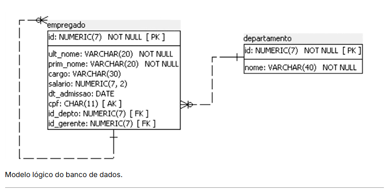
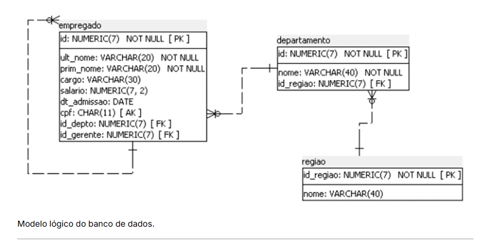

# Criação de banco de dados e tabelas na prática 02

Vamos então implementar um banco de dados a partir do modelo lógico a seguir.



````markdown
# PostgreSQL - Script Completo de Criação e Manipulação do Banco de Dados

Este documento apresenta um exemplo completo de implementação de um banco de dados relacional no PostgreSQL utilizando o modelo lógico composto pelas tabelas **DEPARTAMENTO** e **EMPREGADO**, incluindo a criação do banco de dados, schema, tabelas, inserção de dados e consultas SQL.

---

# 1. Criando o Banco de Dados

```sql
CREATE DATABASE empresa;
```

Após criar o banco de dados, conecte-se a ele utilizando o pgAdmin ou o PSQL antes de executar os próximos comandos.

---

# 2. Criando o Schema

```sql
CREATE SCHEMA rh;
```

---

# 3. Criando a Tabela DEPARTAMENTO

```sql
CREATE TABLE rh.departamento (

    id NUMERIC(7)
        GENERATED ALWAYS AS IDENTITY,

    nome VARCHAR(40) NOT NULL,

    CONSTRAINT pk_departamento
        PRIMARY KEY (id)

);
```

---

# 4. Criando a Tabela EMPREGADO

```sql
CREATE TABLE rh.empregado (

    id NUMERIC(7)
        GENERATED ALWAYS AS IDENTITY,

    ult_nome VARCHAR(20) NOT NULL,

    prim_nome VARCHAR(20) NOT NULL,

    cargo VARCHAR(30),

    salario NUMERIC(7,2),

    dt_admissao DATE,

    cpf CHAR(11) UNIQUE,

    id_depto NUMERIC(7),

    id_gerente NUMERIC(7),

    CONSTRAINT pk_empregado
        PRIMARY KEY (id),

    CONSTRAINT fk_departamento
        FOREIGN KEY (id_depto)
        REFERENCES rh.departamento(id),

    CONSTRAINT fk_gerente
        FOREIGN KEY (id_gerente)
        REFERENCES rh.empregado(id)

);
```

---

# 5. Inserindo Dados na Tabela DEPARTAMENTO

```sql
INSERT INTO rh.departamento (nome)
VALUES

('Recursos Humanos'),
('Financeiro'),
('Tecnologia'),
('Marketing'),
('Comercial'),
('Jurídico'),
('Compras');
```

---

# 6. Inserindo Dados na Tabela EMPREGADO

## Diretor Geral

```sql
INSERT INTO rh.empregado
(
    ult_nome,
    prim_nome,
    cargo,
    salario,
    dt_admissao,
    cpf,
    id_depto,
    id_gerente
)
VALUES
(
    'Silva',
    'Carlos',
    'Diretor Geral',
    18000.00,
    '2018-01-15',
    '11111111111',
    3,
    NULL
);
```

---

## Demais Funcionários

```sql
INSERT INTO rh.empregado
(
    ult_nome,
    prim_nome,
    cargo,
    salario,
    dt_admissao,
    cpf,
    id_depto,
    id_gerente
)
VALUES

('Oliveira','Mariana','Gerente RH',8500.00,'2019-04-10','22222222222',1,1),

('Souza','Fernando','Analista RH',4500.00,'2021-08-12','33333333333',1,2),

('Pereira','Lucas','Gerente Financeiro',9200.00,'2018-11-02','44444444444',2,1),

('Costa','Ana','Analista Financeiro',5200.00,'2022-03-20','55555555555',2,4),

('Lima','Ricardo','Gerente TI',10500.00,'2017-06-18','66666666666',3,1),

('Almeida','Juliana','Desenvolvedora',6800.00,'2023-01-11','77777777777',3,6),

('Martins','Bruno','Administrador de Banco de Dados',7800.00,'2021-09-15','88888888888',3,6),

('Rocha','Patrícia','Gerente Marketing',8900.00,'2020-05-07','99999999999',4,1),

('Ferreira','Camila','Analista Marketing',4700.00,'2022-07-01','10101010101',4,9),

('Santos','Eduardo','Gerente Comercial',9300.00,'2019-10-25','20202020202',5,1),

('Barbosa','João','Vendedor',3900.00,'2023-04-12','30303030303',5,11),

('Gomes','Fernanda','Advogada',9500.00,'2020-08-19','40404040404',6,1),

('Moreira','Roberto','Comprador',6100.00,'2021-02-14','50505050505',7,1);
```

---

# 7. Consultando Todos os Departamentos

```sql
SELECT *
FROM rh.departamento;
```

---

# 8. Consultando Todos os Empregados

```sql
SELECT *
FROM rh.empregado;
```

---

# 9. Consultando Empregados e seus Departamentos

```sql
SELECT

    e.id,
    e.prim_nome,
    e.ult_nome,
    d.nome AS departamento,
    e.cargo,
    e.salario,
    e.dt_admissao

FROM rh.empregado e

INNER JOIN rh.departamento d

ON e.id_depto = d.id

ORDER BY e.id;
```

---

# 10. Consultando Empregados e seus Gerentes

```sql
SELECT

    e.id,

    e.prim_nome || ' ' || e.ult_nome AS empregado,

    g.prim_nome || ' ' || g.ult_nome AS gerente

FROM rh.empregado e

LEFT JOIN rh.empregado g

ON e.id_gerente = g.id

ORDER BY empregado;
```

---

# 11. Funcionários por Departamento

```sql
SELECT

    d.nome AS departamento,

    COUNT(e.id) AS quantidade_funcionarios

FROM rh.departamento d

LEFT JOIN rh.empregado e

ON d.id = e.id_depto

GROUP BY d.nome

ORDER BY quantidade_funcionarios DESC;
```

---

# 12. Média Salarial por Departamento

```sql
SELECT

    d.nome AS departamento,

    ROUND(AVG(e.salario),2) AS media_salarial

FROM rh.departamento d

INNER JOIN rh.empregado e

ON d.id = e.id_depto

GROUP BY d.nome

ORDER BY media_salarial DESC;
```

---

# 13. Folha Salarial por Departamento

```sql
SELECT

    d.nome AS departamento,

    SUM(e.salario) AS folha_pagamento

FROM rh.departamento d

INNER JOIN rh.empregado e

ON d.id = e.id_depto

GROUP BY d.nome

ORDER BY folha_pagamento DESC;
```

---

# 14. Maior Salário

```sql
SELECT

    prim_nome,
    ult_nome,
    cargo,
    salario

FROM rh.empregado

ORDER BY salario DESC

LIMIT 1;
```

---

# 15. Menor Salário

```sql
SELECT

    prim_nome,
    ult_nome,
    cargo,
    salario

FROM rh.empregado

ORDER BY salario

LIMIT 1;
```

---

# 16. Funcionários Admitidos Após 2020

```sql
SELECT

    prim_nome,
    ult_nome,
    cargo,
    dt_admissao

FROM rh.empregado

WHERE dt_admissao >= '2020-01-01'

ORDER BY dt_admissao;
```

---

# 17. Funcionários com Salário Superior a R$ 8.000,00

```sql
SELECT

    prim_nome,
    ult_nome,
    cargo,
    salario

FROM rh.empregado

WHERE salario > 8000

ORDER BY salario DESC;
```

---

# 18. Quantidade Total de Funcionários

```sql
SELECT

COUNT(*) AS total_funcionarios

FROM rh.empregado;
```

---

# 19. Salário Médio da Empresa

```sql
SELECT

ROUND(AVG(salario),2) AS salario_medio

FROM rh.empregado;
```

---

# 20. Total da Folha Salarial

```sql
SELECT

SUM(salario) AS folha_total

FROM rh.empregado;
```

---

# 21. Consultar Funcionários Ordenados pelo Sobrenome

```sql
SELECT

prim_nome,
ult_nome,
cargo

FROM rh.empregado

ORDER BY ult_nome;
```

---

# 22. Consultar Funcionários do Departamento de Tecnologia

```sql
SELECT

e.prim_nome,
e.ult_nome,
e.cargo

FROM rh.empregado e

INNER JOIN rh.departamento d

ON e.id_depto = d.id

WHERE d.nome = 'Tecnologia';
```

---

# 23. Consultar Gerentes

```sql
SELECT

prim_nome,
ult_nome,
cargo

FROM rh.empregado

WHERE cargo LIKE 'Gerente%';
```

---

# Modelo Relacional

```text
DEPARTAMENTO
-------------------------
id (PK)
nome

EMPREGADO
-------------------------
id (PK)
ult_nome
prim_nome
cargo
salario
dt_admissao
cpf (UNIQUE)
id_depto (FK)
id_gerente (FK)

Relacionamentos

DEPARTAMENTO (1) -------- (N) EMPREGADO

EMPREGADO (1) -------- (N) EMPREGADO
                 (Gerente → Funcionário)
```
````

Para realizar a atividade, considere o seguinte modelo lógico:



1. Abra o query tool no banco da empresa.
 
2. Crie a tabela região conforme o modelo anterior.

3. Acrescente a coluna id_regiao na tabela departamento.

4. Defina a coluna id_regiao como chave estrangeira para região.

5. Elimine as tabelas região, departamento e empregado.

6. Recrie as tabelas utilizando o script da empresa.

````markdown
# Laboratório PostgreSQL - Tratativas para Tabelas Relacionadas

## Objetivo

Este laboratório tem como objetivo praticar a criação de tabelas relacionadas, a alteração da estrutura de tabelas existentes, a criação de chaves estrangeiras e a remoção de tabelas considerando as restrições de integridade referencial do PostgreSQL.

> **Importante:** Este laboratório **não recria as tabelas EMPREGADO e DEPARTAMENTO**, pois elas já existem no banco de dados **empresa**. O foco é apenas criar a tabela **REGIAO**, alterar a tabela **DEPARTAMENTO**, criar o relacionamento entre elas e, posteriormente, remover e recriar as tabelas conforme solicitado.

---

# Passo 1

Acesse o PostgreSQL utilizando o **pgAdmin 4**.

---

# Passo 2

Abra o banco de dados **empresa**.

Abra o **Query Tool**.

---

# Passo 3

## Criar a tabela REGIAO

```sql
CREATE TABLE rh.regiao (

    id_regiao NUMERIC(7) GENERATED ALWAYS AS IDENTITY,

    nome VARCHAR(40),

    CONSTRAINT pk_regiao
        PRIMARY KEY (id_regiao)

);
```

---

# Passo 4

## Inserir dados na tabela REGIAO

```sql
INSERT INTO rh.regiao (nome)
VALUES
('Norte'),
('Nordeste'),
('Centro-Oeste'),
('Sudeste'),
('Sul');
```

---

# Passo 5

## Acrescentar a coluna id_regiao na tabela DEPARTAMENTO

```sql
ALTER TABLE rh.departamento

ADD COLUMN id_regiao NUMERIC(7);
```

---

# Passo 6

## Criar a chave estrangeira entre DEPARTAMENTO e REGIAO

```sql
ALTER TABLE rh.departamento

ADD CONSTRAINT fk_departamento_regiao

FOREIGN KEY (id_regiao)

REFERENCES rh.regiao(id_regiao);
```

---

# Passo 7

## Atualizar os departamentos informando sua região

```sql
UPDATE rh.departamento
SET id_regiao = 4
WHERE id = 1;
```

```sql
UPDATE rh.departamento
SET id_regiao = 4
WHERE id = 2;
```

```sql
UPDATE rh.departamento
SET id_regiao = 5
WHERE id = 3;
```

```sql
UPDATE rh.departamento
SET id_regiao = 3
WHERE id = 4;
```

```sql
UPDATE rh.departamento
SET id_regiao = 2
WHERE id = 5;
```

```sql
UPDATE rh.departamento
SET id_regiao = 1
WHERE id = 6;
```

```sql
UPDATE rh.departamento
SET id_regiao = 4
WHERE id = 7;
```

---

# Passo 8

## Consultar os departamentos e suas respectivas regiões

```sql
SELECT

d.id,

d.nome AS departamento,

r.nome AS regiao

FROM rh.departamento d

INNER JOIN rh.regiao r

ON d.id_regiao = r.id_regiao

ORDER BY d.id;
```

---

# Passo 9

## Eliminar a tabela REGIAO

Como existe uma chave estrangeira na tabela **DEPARTAMENTO**, o comando abaixo retornará erro.

```sql
DROP TABLE rh.regiao;
```

Para remover automaticamente todas as dependências:

```sql
DROP TABLE rh.regiao CASCADE;
```

---

# Passo 10

## Eliminar a tabela DEPARTAMENTO

Como a tabela **EMPREGADO** possui uma chave estrangeira apontando para **DEPARTAMENTO**, utilize:

```sql
DROP TABLE rh.departamento CASCADE;
```

---

# Passo 11

## Eliminar a tabela EMPREGADO

Caso ela ainda exista:

```sql
DROP TABLE rh.empregado;
```

---

# Passo 12

## Reexecutar o script da empresa

Após remover as tabelas, execute novamente o **script da empresa**, que deverá recriar toda a estrutura do banco de dados (**EMPREGADO**, **DEPARTAMENTO** e **REGIAO**, juntamente com todas as chaves primárias, chaves estrangeiras e demais restrições).

> **Observação:** Neste laboratório não é necessário escrever novamente o script de criação das tabelas, pois o enunciado determina apenas que ele seja executado após a remoção das tabelas.

---

# Consultas de Verificação

## Consultar regiões

```sql
SELECT *
FROM rh.regiao;
```

---

## Consultar departamentos

```sql
SELECT *
FROM rh.departamento;
```

---

## Consultar departamentos e regiões

```sql
SELECT

d.id,

d.nome AS departamento,

r.nome AS regiao

FROM rh.departamento d

INNER JOIN rh.regiao r

ON d.id_regiao = r.id_regiao;
```

---

# Modelo Lógico Resultante

```text
REGIAO
-----------------------------
id_regiao (PK)
nome

          1
REGIAO -------------------< DEPARTAMENTO

DEPARTAMENTO
-----------------------------
id (PK)
nome
id_regiao (FK)

          1
DEPARTAMENTO ------------< EMPREGADO

EMPREGADO
-----------------------------
id (PK)
ult_nome
prim_nome
cargo
salario
dt_admissao
cpf (UNIQUE)
id_depto (FK)
id_gerente (FK)
```
````
